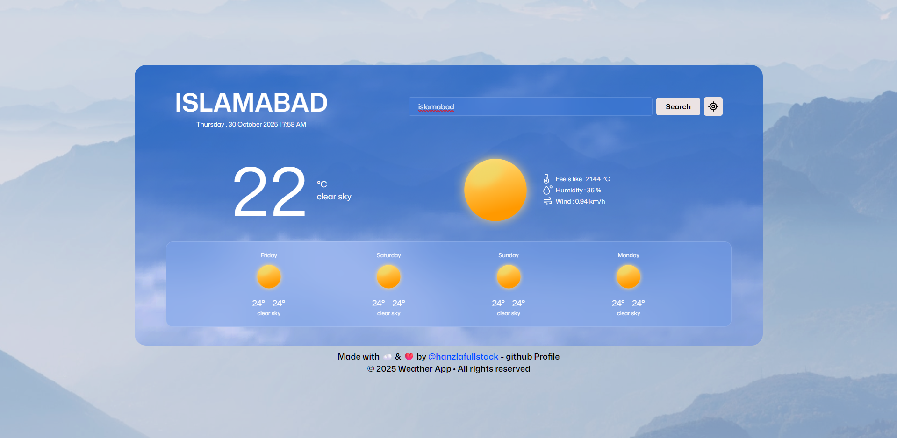
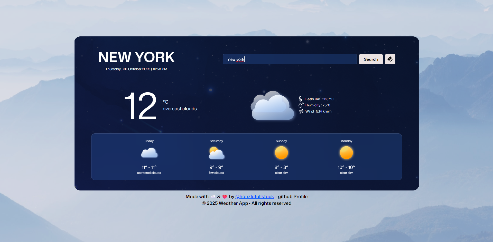

# ☁️ Weather App

A responsive weather app that shows real time conditions and a five day forecast for any city. It supports geolocation, day and night themes, and timezone aware time display.

[Deployed App](https://hanzlafullstack-weather-app.vercel.app/) • [GitHub Repo](https://github.com/hanzlafullstack/Weather-App)

 

## Overview

I built this to practice real API integration and to manage practical UI states like loading, errors, and empty input. The focus is on clear function boundaries, readable names, and a mobile first layout.

## Tech Stack

- HTML5 for structure
- CSS3 for layout and responsive design
- JavaScript (ES6+) for app logic
- Fetch API with async and await
- OpenWeatherMap API for weather and forecast
- Geolocation API to detect the current location

## Features

- Current weather: temperature, feels like, humidity, wind
- Five day forecast using the midday snapshot for consistency
- Day and night backgrounds based on the city’s local time
- Dynamic icons that match weather conditions
- Search by city and a one click “use my location”
- Mobile first, responsive layout

## Folder Structure

```
Weather-App/
│
├── index.html
├── style.css
├── script.js
├── icons/ # Weather SVGs
├── backgrounds/ # day-preview.png, night-preview.png, other assets
└── weather/ # Additional icons/assets if needed
```

## What Went Well

- Timezone handling keeps the displayed time accurate for each city
- UI updates are small and predictable with focused helper functions
- Forecast rendering is simple and easy to adjust

## What I’d Improve Next

- More robust error handling for rate limits and offline states
- Cache the last successful city for faster reloads
- Small loading indicators during fetches

## What I Learned

- Structuring API calls with async and await and handling errors
- Practical timezone handling for remote cities
- Rendering lists from API data and keeping the UI in sync
- Writing small, descriptive functions for maintainability

## Setup

1. Get a free API key from OpenWeatherMap: https://openweathermap.org/api  
2. Open `script.js` and set your key: 
   ```js
   
   const APIKey = "YOUR_API_KEY";
   ```
3. Run locally:
   - Open `index.html` directly, or start a simple server:
     ```bash
     npx serve .
     # or
     python -m http.server 5173
     ```
4. Deploy:
   - You can deploy to Vercel or Netlify. Current deployment:  
     https://weather-app-three-sigma-54.vercel.app/

## Notes

- Icons map to standard OpenWeatherMap condition codes
- Forecast uses the 12:00 entry for each day to keep the view consistent

## License

For learning and portfolio use. Weather data and brand assets belong to their respective owners.

References:  
- Deployed app: <a href="https://hanzlafullstack-weather-app.vercel.app/">https://hanzlafullstack-weather-app.vercel.app/</a>
- Repository: <a href="https://github.com/hanzlafullstack/Weather-App">https://github.com/hanzlafullstack/Weather-App</a>
